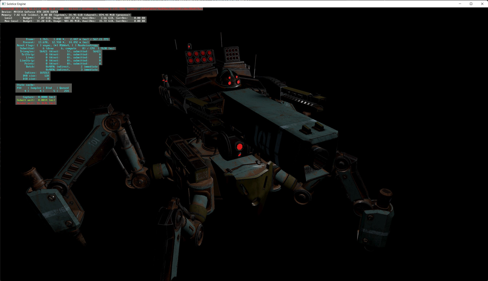
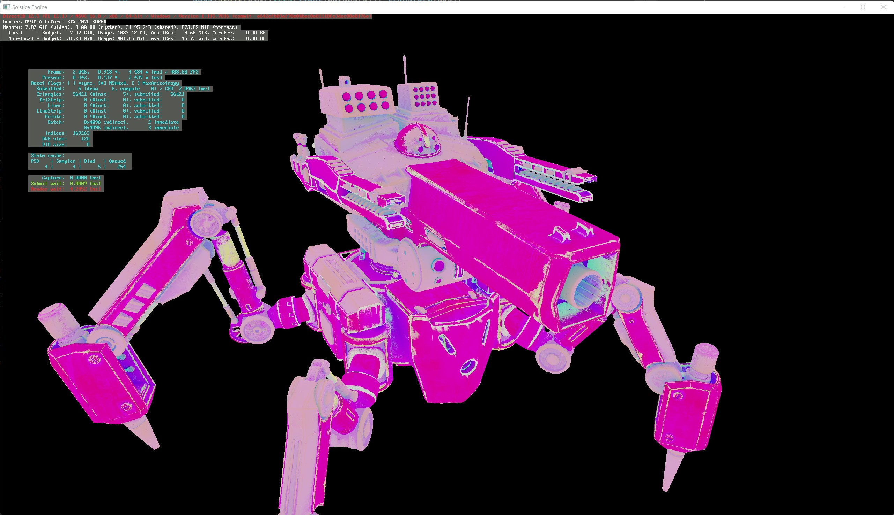
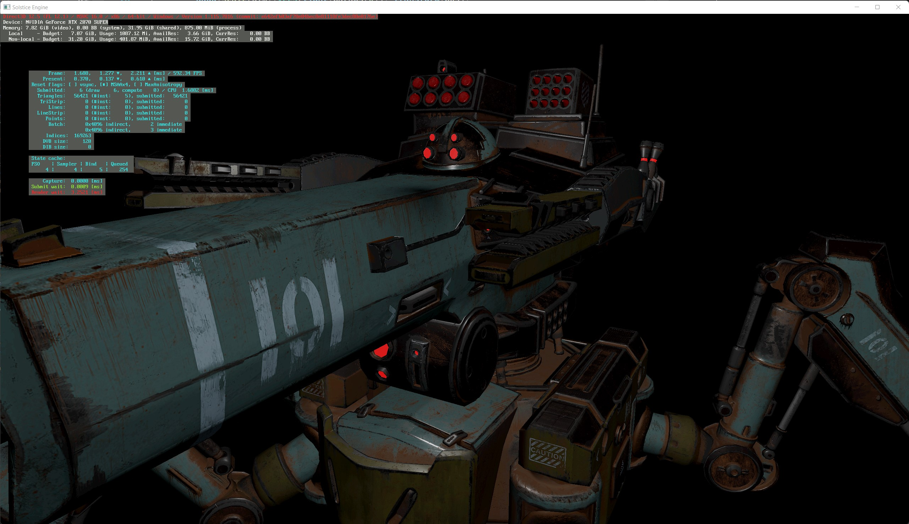

# SolsticeGE

A high performance game engine for procedural worlds. Uses an entity component system for high performance multithreaded logic. Currently very work in progress!

Current TODO list:
 - Image based indirect lighting
 - SSAO
 - Multithreading
 - Post processing
 - Move render passes out of EngineWrapper and into a more modular system. 

Model Credit:
"IMC Spider Tank" (https://skfb.ly/o6TGw) by Valery Kharitonov is licensed under Creative Commons Attribution (http://creativecommons.org/licenses/by/4.0/).

